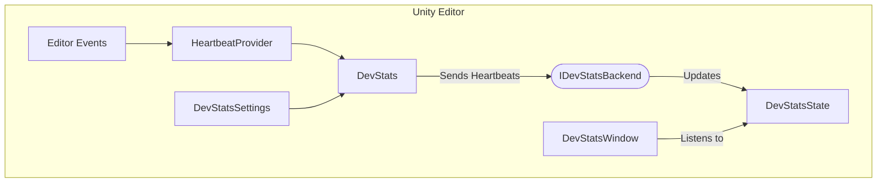

DevStats is a Unity editor plugin that brings automatic time tracking into the Unity workflow by integrating with WakaTime, a widely-used developer productivity service. 
The plugin passively monitors editor activity such as scene edits, asset saves, and hierarchy changes and notifies WakaTime CLI of project activity.
A built-in editor window surfaces the resulting stats as interactive graphs and breakdowns without leaving Unity.

This plugin perfectly pairs with your favorite IDE WakaTime plugin for full coverage of your development activity.

For feature list please check out the github!

# Technical Highlights

**Clean Architecture** - The system is built around simple principles that keep each layer independent and replaceable.

**Fully event-driven UI** - Core classes expose typed C# events which the editor UI subscribes to. This allows the core system to stay decoupled from the UI while also providing an easy way for any other system to listen to for changes.

**Flexible Settings** - There's a wide variety of settings to play with including variable heartbeat send rate, UI refresh rate, etc. Settings are saved to EditorPrefs on a per-project basis.

**Backend abstraction** - All tracking service logic lives behind an interface. Because of this the WakaTime implementation is swappable to any other activity track service without touching the core system or UI.


# Tech Deep Dive


The overall architecture is quite simple.

The static `DevStats` class is the core of the system. 
It holds an instance of the HeartbeatProvider to gather heartbeats and then interfaces with the IDevStatsBackend to notify the backend that ultimately handles the time tracking.
The DevStats class also manages the settings and adjusts behavior accordingly.
```csharp
    public static class DevStats
    {
        private static IDevStatsBackend Backend; // Backend implementation, aka WakaTime CLI
        private static HeartbeatProvider m_heartbeatProvider; // Hooks into Unity events for editor changes
        private static DevStatsState m_state; // Locally cached stats and heartbeats. Serialized to EditorPrefs.
        private static DevStatsSettings m_settings; // User settings
            
        private static void OnEditorUpdate() { } // Evaluate if it's time to POST
        private static async Task SendHeartbeatsToBackend(List<Heartbeat> heartbeats) { }
        private static void RetryFailedHeartbeats() { }
        
        public static void TriggerHeartbeat(Heartbeat heartbeat) { } // Can be manually called by anyone.
    }
```


The `HeartbeatProvider` lives very close to Unity, subscribing to various Unity Editor delegates to collect "heartbeats" from various interactions including scene/prefab edits, changes to scriptable objects, and project saves.

Here's what a collected heartbeat looks like:
```csharp
    [Serializable]
    public struct Heartbeat
    {
        public string FilePath; // Path of the file that was changed or saved
        public double Timestamp; // Time of change
        public bool IsWrite; //  Whether this was a save
    }
```

DevStats takes these heartbeats and manages them under a set of rules:
- Collect heartbeats in a queue to send at a set frequency.
- Manage a "Same File Cooldown" to prevent generating too many heartbeats for one interaction.
- Locally store any heartbeat collections that failed to send to try again later.

We save all collected heartbeats into the `DevStatsState` which is a fully serialized system state struct. 
Saving the heartbeats ensures that we do not lose any of them between editor restarts. We also save any heartbeats that failed to send here.

When it's time to POST the collected heartbeats we talk to the `IDevStatsBackend`.
```csharp
    public interface IDevStatsBackend
    {
        public bool CanRun { get; }
        
        Task<CommandResult> Load();
        Task<CommandResult> SendHeartbeats(List<Heartbeat> heartbeats);
        Task<StatsData> GetStats();
        Task<CommandResult> Unload();
    }
```
This is an interface that decouples the core system from any specific tracking service. The only current implementation is WakatimeBackend. A custom backend could be provided without touching any other layer.

The `WakatimeBackend` enables this API by internally managing a Wakatime CLI as an external process. Stats are fetched via the WakaTime REST API using UnityWebRequests.
The implementation is not as pretty to look at but you can find it [here](https://github.com/hs-pp/DevStats/blob/main/Editor/Wakatime/WakatimeBackend.cs).


The `DevStatsWindow` is our Unity Editor window that listens to changes to DevStatsState.


The stats pages is our main screen for information. Here we can see our daily, weekly, and all time stats. 
Update frequency of this screen can be set in the setting or forced using the button at the top right.


The heartbeats panel shows the current status of the collected and failed heartbeats. It also shows when the next POST to the backend will be.


The settings is pretty self-explanatory. These settings are stored in `DevStatsSettings` which is consumed by the DevStats static class to change core system behavior.


Lastly, the editor window is meant to live docked to the main Unity editor. I personally like to keep it always visible to see my day to day progress.


DevStats is a feature complete plugin that I use daily. 